# Image Processing
Time : 2020 fall (first half semester of sophomore)

## lecture
|subject|teacher|
|:-:|:-:|
|[影像處理](http://class-qry.acad.ncku.edu.tw/syllabus/online_display.php?syear=0109&sem=1&co_no=E246700&class_code=)|[林家祥](https://sites.google.com/view/chiahsianglin/home)|

<br>

## Report
- [Midterm](#Midterm)
- [Final](#Final)

<br>

## Environment
1. OS
- `Windows 10 21H1`
2. Software
- `Matlab R2021a`

<br>

## How to Run
1. download repo
```
git clone https://github.com/HsuChiChen/image-processing.git
```

2. open matlab
```
matlab
```
3. run the `main.m` in `midterm` or `final` file<br>
press run gui icon in matlab

<br>

## Midterm
### Rrequirement
|input|output|
|:-:|:-:|
|hyperspectral imgae|signature of the 3 material|

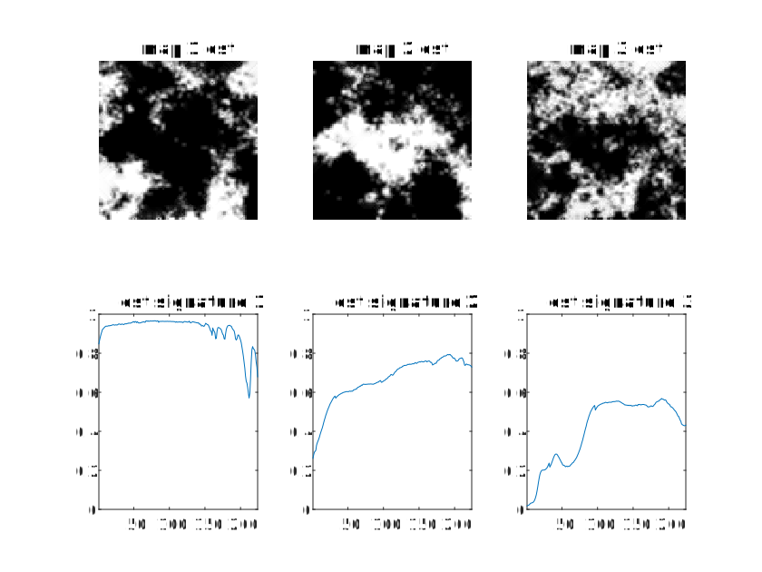
> More info is in `doc/midterm_rule.pdf`

### Algorithm
>由於Github不支援`latex`語法建議於`doc/midterm_demo.pptx`觀看以獲得更好的理解。

1. 主成分分析(PCA)降維
    - 資料**平移**到0
    - 解共變異數矩陣的特徵值(λ)和特徵向量(𝑣)
    - 取變異量(特徵值)**最大與次之**的兩主成份

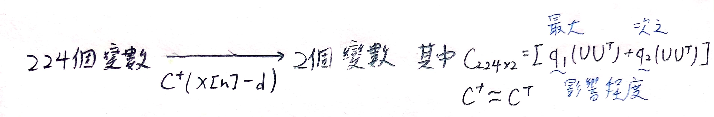

2. SPA找單形體頂點

|頂點|尋找方法|
|:-:|:-:|
|頂點1|離**原點**最遠的點|
|頂點2|算(頂點一到原點)的**垂直投影矩陣**求所有投影點離原點最遠的點|
|頂點3|在投影面上離**投影後頂點二**距離最遠的投影點|

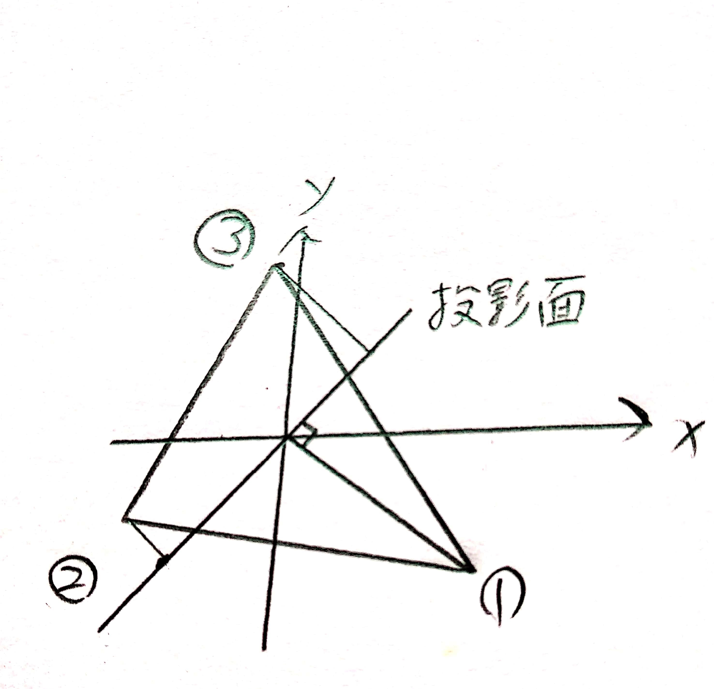

3. 修正頂點
    - 取𝑎­2−𝑎­3的法向量(二維時`(a,b)→(−b,a)`)
    - 取頂點二在圓範圍內與(1)做內積，求最大值之頂點`p_1`
    - 取頂點三在圓範圍內與(1)做內積，求最大值之頂點`p_2`
    - 求`p_1`,`p_2`之法向量b
    - 求`p_2`上在`b`的投影即為位移量`h`
    - 有法向量`b`與位移量`h`即可描述該直線，重複(1)-(6)求得其他兩直線
    - 兩直線解聯立方程式得實際頂點`P`

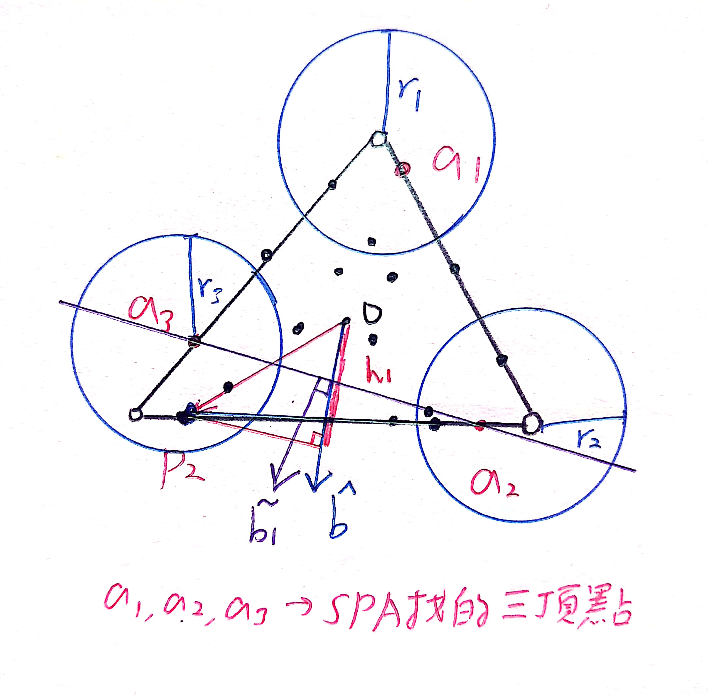

4. 做PCA反運算得物質指紋`𝑃=𝐶𝑎_𝑖+𝑑`

5. 分布圖<br>
利用高中觀念，求`任意點a點到直線的距離/頂點P到直線的距離`，即為該點所占成分比例

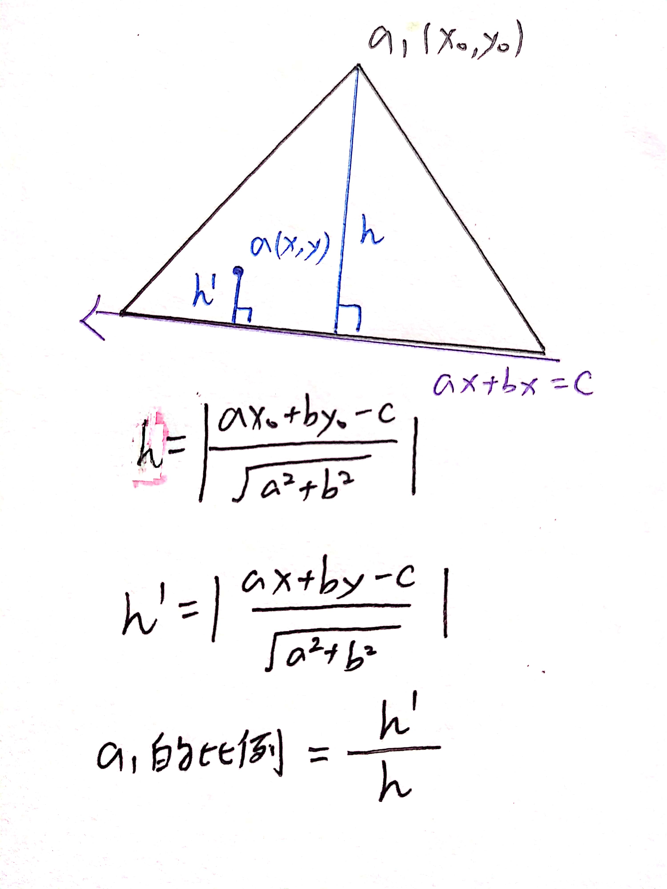


- 演算法驗證<br>
發現助教給的數據很完美，修正前後點是一樣的。

 |X|頂點一|頂點二|頂點三|
|:-:|:-:|:-:|:-:|
|X點(SPA)|4.509814|0.16576|-3.65346|
|Y點(SPA)|-0.23925|0.753292|-0.40151|
|X點(修正)|4.509814|0.16576|-3.65346|
|Y點(修正)|-0.23925|0.753292|-0.40151|

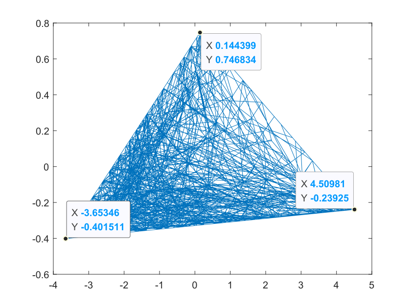


<br>

## Final
### Rrequirement
|input|output|
|:-:|:-:|
|hyperspectral imgae with some **missing data**|signature of the 3 material|

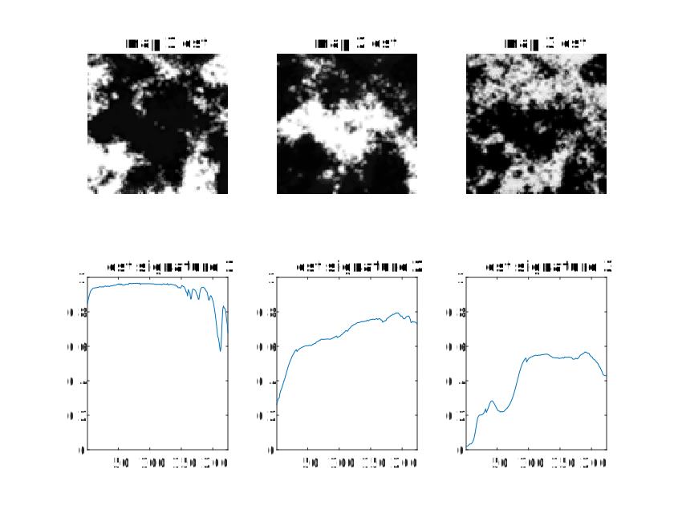
with error of `9.1214e-04`
> More info is in `doc/final_rule.pdf`

### Algorithm
>由於Github不支援`latex`語法建議於`doc/final_demo.pptx`觀看以獲得更好的理解。

- Missing Data選取

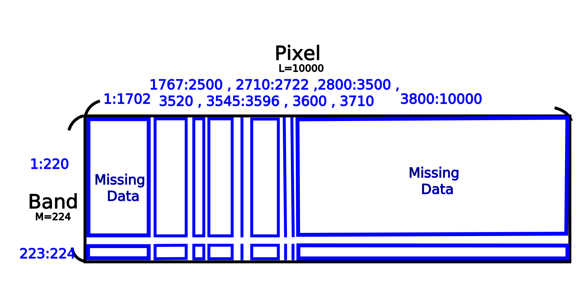

|before|after|
|:-:|:-:|
|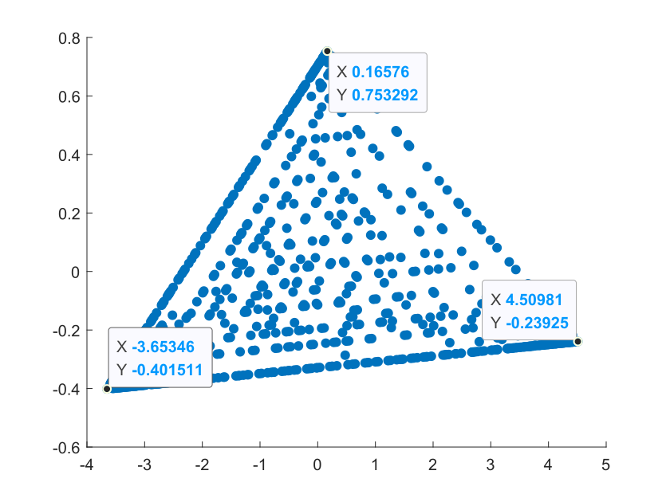|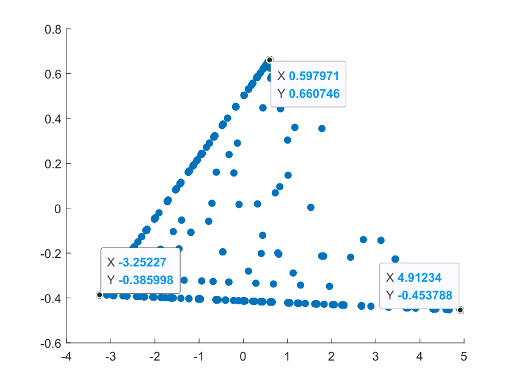|

1. 求A

|input|output|
|:-:|:-:|
|Y_omega|A|

Y_omega做`HyperCSI`(期中考內容)得指紋A
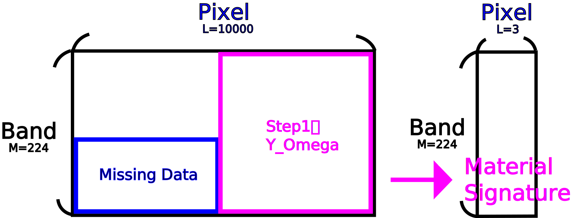

2. 求S

|input|output|
|:-:|:-:|
|Y_omega2|Y_re|

Y_omega2做PCA降維`N=224→2`

|input|output|
|:-:|:-:|
|A_omega|h, b, alpha|

求A_omega做PCA降維後
的點alpha以及代表Hyperplane的點h、法向量b

|input|output|
|:-:|:-:|
|Y_re, h, b, alpha|S|

點到線之距離公式
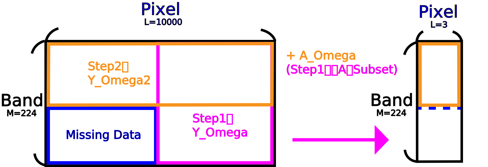
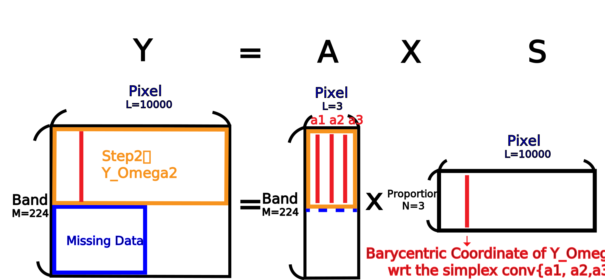

3. 求Y

|input|output|
|:-:|:-:|
|A, S|Y|


